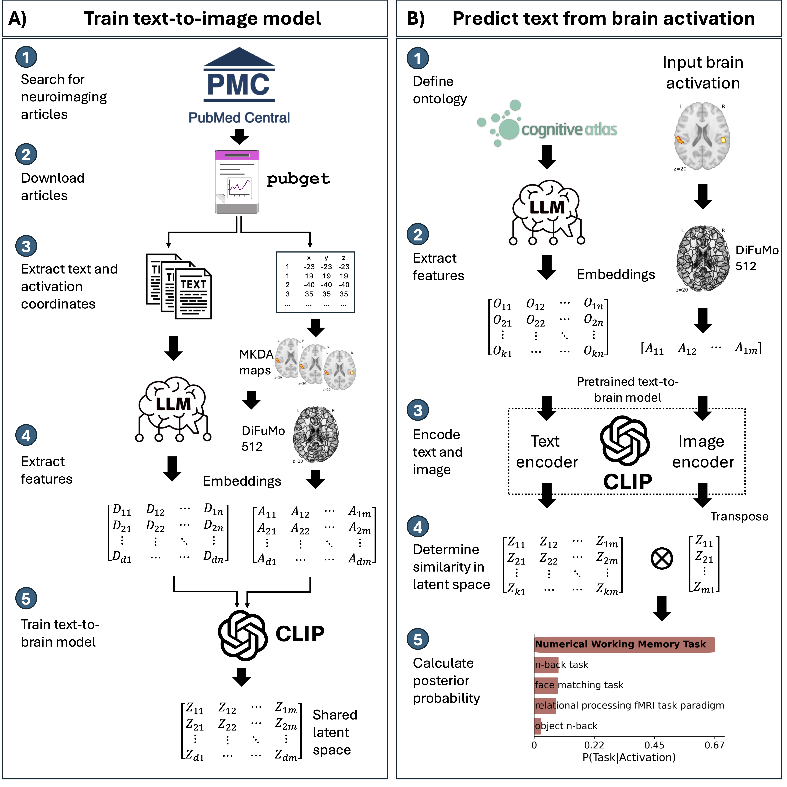

# NiCLIP

`Warning:` README is currently in progress. Please check back later.

[[Paper]](https://doi.org/10.1101/2025.06.14.659706)

We present NiCLIP, a neuroimaging contrastive language-image pretraining model designed for predicting text from brain images. NiCLIP is built upon the NeuroConText model’s CLIP architecture while enhancing the text encoding with the assistance of BrainGPT, a pre-trained LLM fine-tuned on neuroscience papers.

## Approach



**Overview of the framework for training the text-to-brain model and decoding brain activation maps.**
(A) The text-to-brain CLIP model is trained using text and brain activation coordinates sourced from a collection of fMRI articles downloaded from PubMed Central. Pubget is used to download and preprocess the articles in a standardized format. Text embeddings are determined using a pre-trained LLM. In contrast, image embeddings is obtained by first calculating an MKDA-modeled activation brain map, and second applying a continuous brain parcellation defined by the DiFuMo 512 atlas. (B) The brain decoding model relies on a cognitive ontology to predict text from input brain activation. The embeddings of task names along with their definitions are extracted using an LLM transformer, while image features are determined using the DiFuMo brain parcellation. The text and image embeddings are processed through the pre-trained text and image encoders from CLIP, yielding new embeddings in a shared latent space. The posterior probability representing the predicted task from the input activation is calculated based on the similarity between the text and image embeddings in the shared latent space.

## Usage

In order to use the code, you will need to install all of the Python libraries
that are required. The required library and associated versions are available in `requirements.txt`.

The easiest way to install the requirements is with Conda.

```bash
# Install conda if you don't have it already
cd /path/to/brain-decoder

# Create a new conda environment and install the requirements
conda create -p /path/to/niclip_env pip python=3.12
conda activate /path/to/niclip_env
pip install -e .[all]
```

### Model training

To train a new model you need text and image embeddings. The text embeddings can be generated using a pre-trained LLM, such as BrainGPT, and the image embeddings can be generated using the DiFuMo brain parcellation atlas.

The embeddings used in the paper can be downloaded from the OSF repository https://osf.io/dsj56/.

- Text embeddings: https://osf.io/v748f
- Image embeddings: https://osf.io/nu2s7

To generate the text embeddings refer to the [text_embedding.py](./jobs/text_embedding.py) script, and to generate the image embeddings refer to the [image_embedding.py](./jobs/image_embedding.py) script. Note that you will need a NiMARE Dataset object (containing articles with peak activation coordinates and text) for these scripts to work, which can be created using the [create_nimare_dset.py](./jobs/create_nimare_dset.py) script.

#### Baseline model

The baseline models (i.e., Neurosynth and GC-LDA) can be trained using the [baseline_train.py](./jobs/baseline_train.py) script.

The trained baseline models use in the paper can be downloaded from the OSF repository here: https://osf.io/dsj56/ in the folder `./results/baseline`.

### Use pre-trained model

Alternatively, you can use the pre-trained model provided in the `./results/pubmed` directory in https://osf.io/dsj56/.

### Predictions

To perform predictions using the trained model, you can use the [predict.py](./braindec/predict.py) script.

- Basic usage: predict task fMRI names from a brain image.

```bash
python ./braindec/predict.py \
    --image /path/to/image.nii.gz \
    --model /path/to/model.pth \
    --vocabulary /path/to/vocabulary.txt \
    --vocabulary_emb /path/to/vocabulary_emb.npy \
    --vocabulary_prior /path/to/vocabulary_prior.npy \
    --reduced True \
    --mask /path/to/mask.nii.gz \
    --topk 10 \
    --logit_scale 10.0 \
    --device cuda:0 \
    --output /path/to/output
```

- Predict tasks, concepts and domains from a brain image. To accomplish this, you will need to provide the `--cognitiveatlas` argument with the path to the Cognitive Atlas directory containing the task, concept, and domain files. Set `--hierarchical` to `True` to enable hierarchical predictions.

```bash
python ./braindec/predict.py \
    --image /path/to/image.nii.gz \
    --model /path/to/model.pth \
    --vocabulary /path/to/vocabulary.txt \
    --vocabulary_emb /path/to/vocabulary_emb.npy \
    --vocabulary_prior /path/to/vocabulary_prior.npy \
    --cognitiveatlas /path/to/cognitiveatlas_dir \
    --hierarchical True \
    --reduced True \
    --mask /path/to/mask.nii.gz \
    --topk 10 \
    --logit_scale 10.0 \
    --device cuda:0 \
    --output /path/to/output
```

Example data:

- Model: [model-clip_section-body_embedding-BrainGPT-7B-v0.2_best.pth](https://osf.io/u3cxh)

- Vocabulary: [vocabulary-cogatlasred_task.txt](https://osf.io/8m2fz)

- Vocabulary embeddings: [vocabulary-cogatlasred_task-combined_embedding-BrainGPT-7B-v0.2.npy](https://osf.io/nza7b)

- Vocabulary prior: [vocabulary-cogatlasred_task-combined_embedding-BrainGPT-7B-v0.2_section-body_prior.npy](https://osf.io/v82za)

- Mask: [MNI152_2x2x2_brainmask.nii.gz](https://osf.io/jzvry)

- Cognitive Atlas: The Cognitive Atlas directory can be downloaded from `.data/cognitive_atlas` in https://osf.io/dsj56/.

Note that this example uses the reduced task vocabulary. Make sure --reduced is set to True when using the reduced vocabulary.

## Citation

If you use this code in your research, please acknowledge this work by citing the
paper: https://doi.org/10.1101/2025.06.14.659706.

## Note

The CLIP model relies on the [NeuroConText](https://github.com/ghayem/NeuroConText) code, which is based on the [CLIP](https://github.com/openai/CLIP) code.
